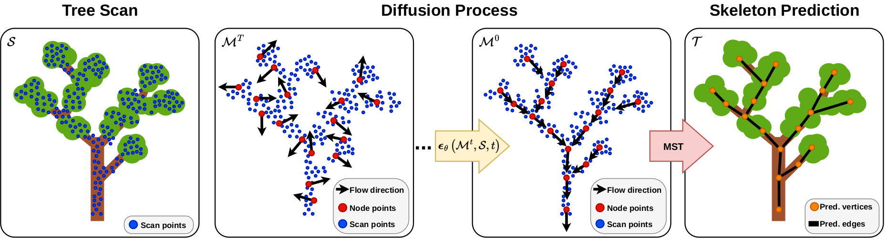

# DiffTS: Diffusion based Tree Skeletonization


This repo contains the code for the tree skeletonization method proposed in the ICCV'25 paper: "Tree Skeletonization from 3D Point Clouds by Denoising Diffusion".

Our approach for tree skeletonization combines a generative denoising diffusion probabilistic model for predicting node positions and branch directions with a classical minimum spanning tree algorithm to infer tree skeletons from 3D point clouds, even in the presence of strong occlusions.



## Setup

Building docker image:

`make build`

Adapt `data_dir` in relevant config file e.g. `DiffTS/config/config_orchard.yaml`. We provide a sample of the orchard dataset in `Datasets/demo`.

## Demo

For running the tree skeletonization inference with the pretrained model on the sample data provided in `DiffTS/Datasets` and visualize the output run the command:

`make test WEIGHTS=pretrained_models/orchard_model.ckpt CONFIG=config/config_orchard.yaml PARAMS="--data.vis_output true"`

## BRANCH3D: A dataset for 3D skeletonization of real orchard trees: 

Along the paper we published also a point cloud dataset of orchard trees with reference skeletons for training and evaluation.
The dataset can be downloaded [here](https://www.ipb.uni-bonn.de/html/projects/DiffTS/BRANCH3D_dataset.zip).
Extract the dataset to `DiffTS/Datasets/BRANCH3D`, so the paths will be:
```
Datasets/
└── BRANCH3D/
    ├── train
    ├── val
    └── test
```
In alternative to copying the data you can define your dataset location by uncommenting the last mount in `docker-compose.yml` to points to the directory containing `BRANCH3D` (e.g. `/home/user/datasets`). Then you have to adapt `data_dir` in `DiffTS/config/config_orchard.yaml` to `/data/BRANCH3D`.

## Pretrained models

You can download the trained model weights and save them to `DiffTS/pretrained_models/`:

- Orchard model [weights](https://www.ipb.uni-bonn.de/html/projects/DiffTS/orchard_model.ckpt)
- SyntheticTrees model [weights](https://www.ipb.uni-bonn.de/html/projects/DiffTS/syntheticTrees_model.ckpt)
- Treenet3D model [weights](https://www.ipb.uni-bonn.de/html/projects/DiffTS/treenet3d_model.ckpt)


## Inference

To run the pretrained model on the orchard dataset you can run `make test WEIGHTS=pretrained_models/orchard_model.ckpt CONFIG=pretrained_models/orchard_model.yaml`.

## Training the diffusion model

For training the diffusion model on the orchard dataset, the configuration is defined in `config/config_orchard.yaml`, and the training can be started with:

`make train CONFIG=config/config_orchard.yaml`


## Citation

If you use this repo, please cite as :

```bibtex
@inproceedings{marks2025iccv,
author = {E. Marks and L. Nunes and F. Magistri and M. Sodano and R. Marcuzzi and L. Zimmermann and J. Behley and C. Stachniss},
title = {{Tree Skeletonization from 3D Point Clouds by Denoising Diffusion}},
booktitle = {Proc.~of the IEEE/CVF Intl.~Conf.~on Computer Vision (ICCV)} },
year = 2025,
}
